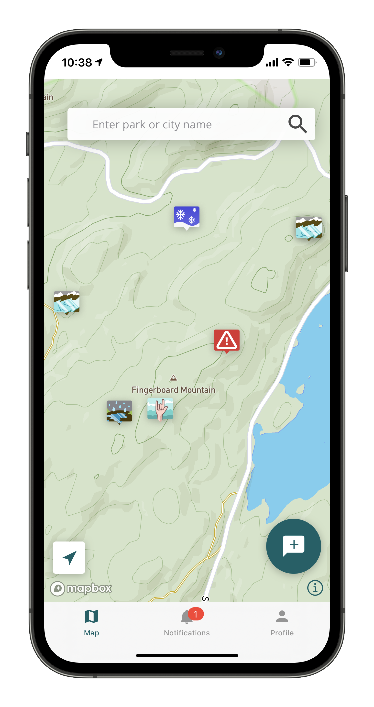
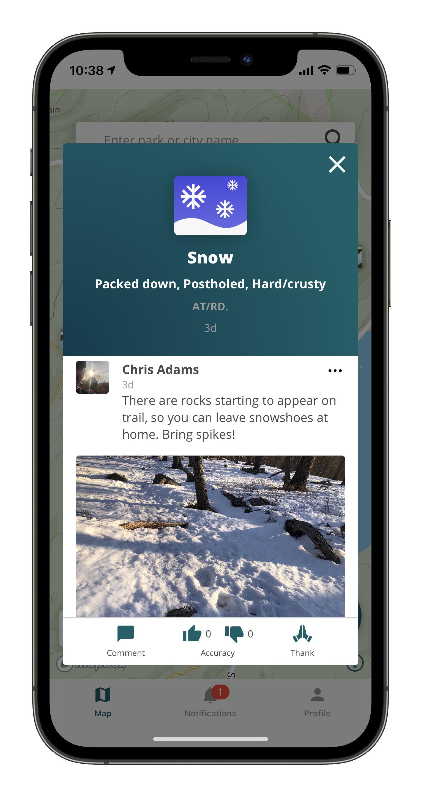
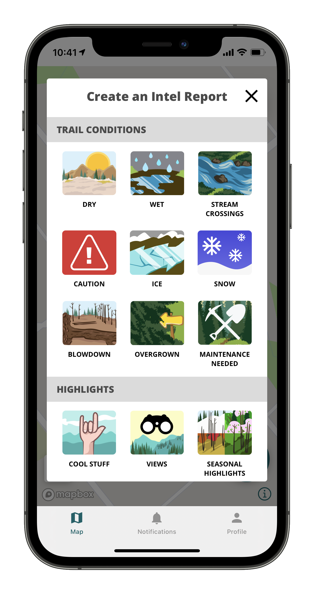
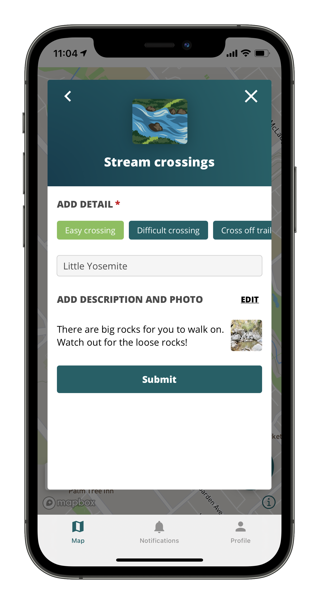

# Hike Intel
## Overview
Hike Intel makes planning hiking trips easier and more fun.

Highlight points of interest on your hike so other hikers can check it out. See areas of caution ahead of time so you can plan to avoid certain trails. Share trail conditions with other hikers so they can be better prepared to tackle the trail. Post photos of animal sightings and converse with others who have seen it too.

## Detailed Walkthrough
The first screen the user sees is a map of trails with the latest posts. Tapping on posts, the user can see a detailed view with photos and comments from other users. Here, the user can contribute to the conversation, confirm the accuracy of the post, or thank the poster for sharing.

 

To create a post, the user starts by selecting a type of trail condition or highlight. The user has to select pre-filled details or they can enter their own detail. For more specific details, the user can enter the trail name, add a more verbose description, and add a photo from their camera.

 
